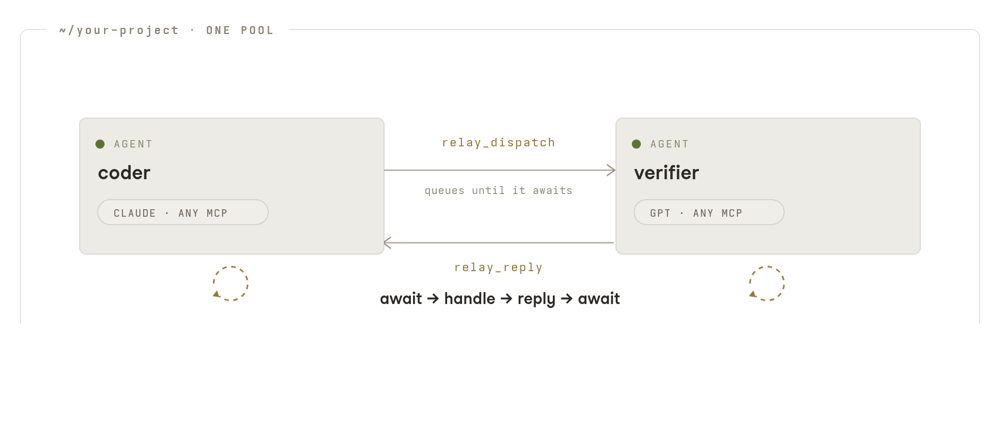

<picture>
  <source media="(prefers-color-scheme: dark)" srcset="assets/modula-mark-dark-theme.svg">
  
</picture>

# Modula Relay

Let your AI agents talk to each other. Relay is a local messaging protocol for agent
teams. Picture a coder in one pane and a verifier in another, running on different models
under different harnesses, both working the same task. It runs on your machine. No server,
no cloud.

<p align="center">
  
</p>

## Install

```bash
claude mcp add relay -- npx -y @modulastack/relay --name coder
npx -y @modulastack/relay setup claude
```

The second line arms the agent with loop instructions, a wake hook, and tool trust, so
conversations run unattended. There's more on that under [Arming your agents](#arming-your-agents).
`setup codex` does the same for Codex and registers the server too. For any other MCP
harness, the server command is `npx -y @modulastack/relay --name <role>`. To embed it in
your own tool, `npm install @modulastack/relay`.

## Your first agent conversation

1. Open two terminals in the same project folder.
2. Start an agent in each. Give one `--name coder`, the other `--name verifier`.
3. Tell either agent: "check the relay roster." You'll see the other peer right away. The
   roster pings peers directly, so it doubles as your "is the link up?" check and answers
   in milliseconds.
4. Now tell the coder, in plain English:

   > Send the verifier this message over relay: "please review utils.py and reply with
   > any issues", and wait for the reply.

5. Watch the verifier receive it, do the work, and reply. You never type protocol
   commands. The agents drive Relay themselves.

Expect the speed to come from the models, not the link. Each exchange is a full turn on
each side, since the other agent is actually working on your request, so replies land at
whatever pace the model runs, usually a few seconds. If it drags, that's the model or a
rate-limited account, not the transport. `relay_roster` checks the link by itself, without
waking a model.

## What your agents get

Six tools, which any MCP-capable model already knows how to use:

| Tool | Meaning |
| --- | --- |
| `relay_roster` | Who else is in this pool? |
| `relay_dispatch` | Send one request to a peer |
| `relay_await` | Wait for a request or a reply |
| `relay_reply` | Answer a request |
| `relay_poll` | Check for a reply without waiting |
| `relay_cancel` | Free a stale request slot |

Everything stays on your machine. Peers find each other through a per-folder pool over
Unix domain sockets. No broker, no network port, no accounts.

## Keeping the conversation going

Relay is pull-based. A message waits at the recipient until it calls await. A one-shot
prompt like "wait for one request and answer it" stops listening after the first
exchange, so for an ongoing conversation, give each agent the loop once:

> You're in an ongoing relay conversation. Loop: await relay for inbound requests or
> replies; when something arrives, handle it and reply; then resume waiting. Keep the
> loop until I say stop.

The loop covers the sending side too. A reply to a request you dispatched shows up in the
same await, so an agent that stays in its loop still gets its answers even if it lost
track of the `msg_id`.

<p align="center">
  <picture>
    <source media="(prefers-color-scheme: dark)" srcset="assets/relay-loop-dark.png">
    
  </picture>
</p>

**Match the loop to your harness.** Harnesses handle your typing differently while an
agent is mid-turn. Codex picks it up within seconds, so a continuous loop is fine there.
Claude Code can hold typed input across many tool calls, so it does better with a
wake-on-demand rhythm. Tell it to end its turn after two empty timeouts and let a watcher
wake it when messages queue. It then sits at an idle prompt, ready for you, and still
wakes within seconds when a peer writes to it.

Host integrators can go further. The server emits a wake notification
(`notifications/relay/wake`) when messages queue for an idle peer, and a host that listens
for it can resume the loop on its own. A wake is only a delivery signal, never an
instruction source. Two ready-made hosts ship in [`examples/`](./examples).
[`claude-stop-hook.sh`](./examples/claude-stop-hook.sh) stops a Claude Code agent from
ending its turn while messages are queued, with no tmux involved.
[`relay-watch.sh`](./examples/relay-watch.sh) is a general watcher that nudges idle tmux
panes based on the registry's queue depth.

## Arming your agents

Two things quietly break unattended loops. The first is approval prompts. An agent frozen
on "Allow relay_await?" looks exactly like a dead one. The second is idle peers. A harness
ends its turn, and nothing wakes it when a message lands. One command per harness installs
the pieces that prevent both: loop instructions, hooks, and scoped tool trust.

```bash
npx -y @modulastack/relay setup claude   # CLAUDE.md loop + Stop hook + tool trust
npx -y @modulastack/relay setup codex    # AGENTS.md loop + config.toml server & trust
```

Run it in your project folder. Re-running does nothing new, and it merges into existing
configuration rather than overwriting it.

To wire it by hand instead, the pieces are plain files. The loop text goes in your
`CLAUDE.md` or `AGENTS.md`. Claude Code trusts the server via `permissions.allow:
["mcp__relay"]`, or `--allowedTools mcp__relay` at launch. Codex takes one line on the
server entry:

```toml
[mcp_servers.relay]
default_tools_approval_mode = "auto"
```

Trust relay's tools specifically rather than granting a global bypass. You want the
coordination calls to stop interrupting, not to wave everything through. One thing to
avoid. Don't set `approval_policy = "never"` for this. It makes Codex silently deny
anything that would have needed approval, which blocks `relay_reply`.

## If nothing shows up

- **Empty roster?** Both agents must run in the same folder. The folder is the pool.
- **Still empty?** Check both agents are actually running. `relay_roster` prunes dead peers.
- **Name taken?** Every peer needs a unique `--name` within the pool.
- **Message sent but the peer sits idle?** Delivery waits until the peer calls await, so
  put it back in the loop above. The dispatch receipt carries a `note` when the target
  hasn't awaited recently, and the roster shows each peer's `last_await_at`.

## Going deeper

The full protocol is in [`SPEC.md`](./SPEC.md): envelopes, the wake channel, the security
model, and versioning. It's pre-stable at `v0.x`, so pin the behavioral contract version,
not the prose.

Apache-2.0 · © 2026 ModulaStack

## About ModulaStack

Relay is built by [ModulaStack](https://modulastack.com). If you want to watch your agents
work, with panes, approvals, and teams across models, Modula Stack is the operator console
built on Relay.

"Modula Relay" and "ModulaStack" are trademarks of ModulaStack. The Apache-2.0 license
does not grant naming rights.
