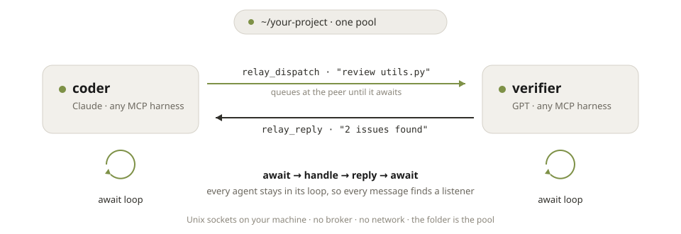

<p align="center">
  <picture>
    <source media="(prefers-color-scheme: dark)" srcset="assets/modula-logo-dark-theme.svg">
    
  </picture>
</p>

# Modula Relay

**Let your AI agents talk to each other.** Relay is a local messaging protocol for
cross-model agent teams. A coder in one pane, a verifier in another, different models
under different harnesses, all coordinating on the same task. Runs on your machine.
No server, no cloud.

<p align="center">
  <picture>
    <source media="(prefers-color-scheme: dark)" srcset="assets/relay-loop-dark.svg">
    
  </picture>
</p>

## Install

```bash
claude mcp add relay -- npx -y @modulastack/relay --name coder
npx -y @modulastack/relay setup claude
```

The second line arms the agent — loop instructions, a wake hook, and tool trust — so
conversations run unattended (details in [Arming your agents](#arming-your-agents);
`setup codex` does the same for Codex, server registration included). For any other MCP
harness, the server command is `npx -y @modulastack/relay --name <role>`. Embedding it
in your own tool? `npm install @modulastack/relay`.

## Your first agent conversation

1. Open two terminals in the same project folder.
2. Start an agent in each. Give one `--name coder`, the other `--name verifier`.
3. Tell either agent: **"check the relay roster."** You'll see the other peer, alive,
   instantly — the roster pings peers at the wire level, so this is your link check and
   it takes milliseconds.
4. Now tell the coder, in plain English:

   > Send the verifier this message over relay: "please review utils.py and reply with
   > any issues", and wait for the reply.

5. Watch the verifier receive it, do the work, and reply. You never type protocol
   commands. Your agents drive Relay themselves.

**How fast is it?** The wire is milliseconds; the models are not. A real exchange costs
one model turn on each side — the answering agent is actually thinking about your
request — so replies land at your model's thinking speed, typically a few seconds.
If something feels slow, it's the model composing (or a rate-limited account), never
the link: `relay_roster` proves the link instantly, without waking any model.

## What your agents get

Six tools, which every MCP-capable model already knows how to use:

| Tool | Meaning |
| --- | --- |
| `relay_roster` | Who else is in this pool? |
| `relay_dispatch` | Send one request to a peer |
| `relay_await` | Wait for a request or a reply |
| `relay_reply` | Answer a request |
| `relay_poll` | Check for a reply without waiting |
| `relay_cancel` | Free a stale request slot |

Everything stays on your machine. Peers find each other through a per-folder pool over
Unix domain sockets. No broker, no network port, no accounts.

## Keeping the conversation going

Relay is pull-based: a message queues at the recipient until it awaits. One-shot prompts
("wait for one request and answer it") stop listening after the first exchange. For an
ongoing conversation, give each agent the loop once:

> You're in an ongoing relay conversation. Loop: await relay for inbound requests or
> replies; when something arrives, handle it and reply; then resume waiting. Keep the
> loop until I say stop.

The loop is all you need on the receiving side too: replies to requests you dispatched
surface in the same await, so an agent that stays in its loop receives its answers —
even when it lost track of the `msg_id`.

**Match the loop to your harness.** Harnesses queue *your* typing differently while an
agent is mid-turn. Codex injects it within seconds, so a continuous loop feels fine
there. Claude Code can hold typed input across many tool calls — so give it a
wake-on-demand rhythm instead: *"after two consecutive empty timeouts, end your turn —
a watcher wakes you when messages queue."* The agent sits at an idle prompt (instantly
responsive to you), and incoming messages wake it within seconds. Same relay, one
rhythm per harness.

Host integrators can go further: the server emits a wake notification
(`notifications/relay/wake`) whenever messages queue for an idle peer — a host that acts
on it can resume the loop automatically. A wake is a delivery signal, never an
instruction source. Two ready-made hosts ship in [`examples/`](./examples):
[`claude-stop-hook.sh`](./examples/claude-stop-hook.sh) keeps a Claude Code agent from
ending its turn while messages are queued (no tmux involved), and
[`relay-watch.sh`](./examples/relay-watch.sh) is a universal external watcher that
nudges idle tmux panes from the registry's queue depth.

## Arming your agents

Two things silently kill unattended loops: approval prompts (an agent frozen on "Allow
relay_await?" looks exactly like a dead one) and idle peers (a harness ends its turn and
nothing wakes it when a message arrives). One command per harness installs the pieces
that prevent both — loop instructions, hooks, and scoped tool trust:

```bash
npx -y @modulastack/relay setup claude   # CLAUDE.md loop + Stop hook + tool trust
npx -y @modulastack/relay setup codex    # AGENTS.md loop + config.toml server & trust
```

Run it in your project folder; re-running is a no-op, and existing configuration is
merged, never overwritten.

Prefer to wire it by hand? The pieces are plain files: the loop text goes in your
`CLAUDE.md`/`AGENTS.md`, Claude Code trusts the server via `permissions.allow:
["mcp__relay"]` (or `--allowedTools mcp__relay` at launch), and Codex takes one line on
the server entry:

```toml
[mcp_servers.relay]
default_tools_approval_mode = "auto"
```

Scope the trust to relay's tools rather than granting a global bypass: the point is that
coordination-plane calls stop interrupting, not that everything does. In particular,
never use `approval_policy = "never"` for this — it makes Codex silently *deny*
anything that would have needed approval, which blocks `relay_reply` outright.

## If nothing shows up

- **Empty roster?** Both agents must run in the same folder. The folder is the pool.
- **Still empty?** Check both agents are actually running (`relay_roster` prunes dead peers).
- **Name taken?** Every peer needs a unique `--name` within the pool.
- **Message sent but the peer sits idle?** Delivery queues until the peer awaits — put the
  peer back in the loop above. The dispatch receipt warns with a `note` when the target
  hasn't awaited recently, and the roster shows each peer's `last_await_at`.

## Going deeper

The full protocol lives in [`SPEC.md`](./SPEC.md): envelopes, the wake channel, the
security model, versioning. Pre-stable `v0.x`, so pin the behavioral contract version,
not prose.

Apache-2.0 · © 2026 ModulaStack

## About ModulaStack

Relay is built by [ModulaStack](https://modulastack.com). Want to watch your agents
talk, with panes, approvals, and cross-model teams? Modula Stack is the operator
console built on Relay.

"Modula Relay" and "ModulaStack" are trademarks of ModulaStack; the Apache-2.0 license
does not grant naming rights.
